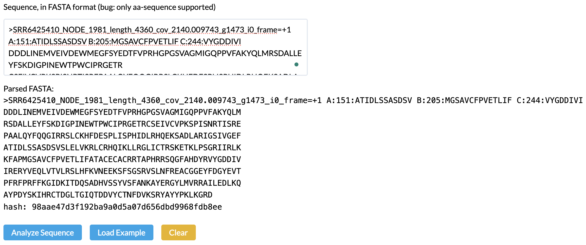
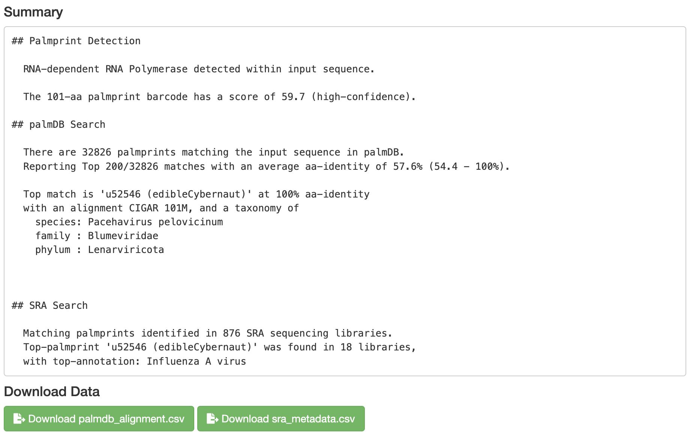
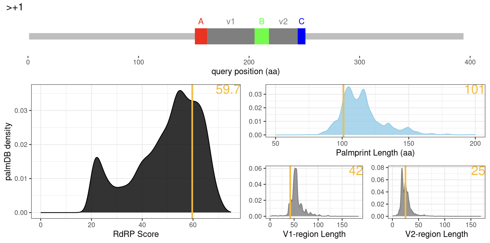
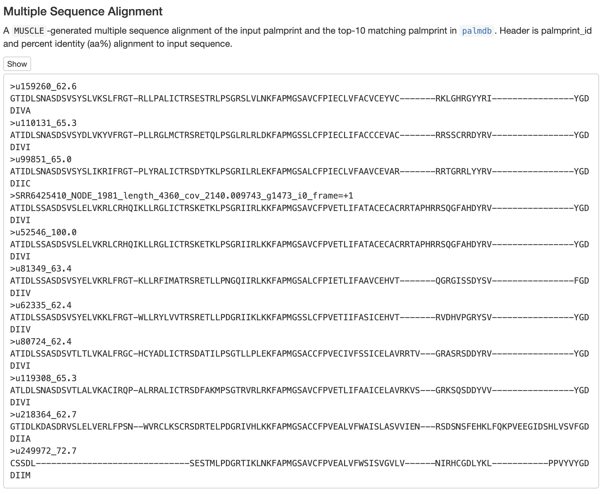
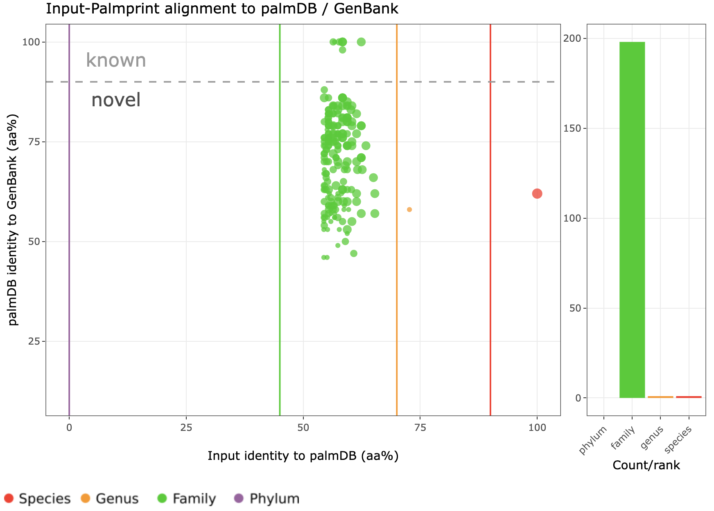
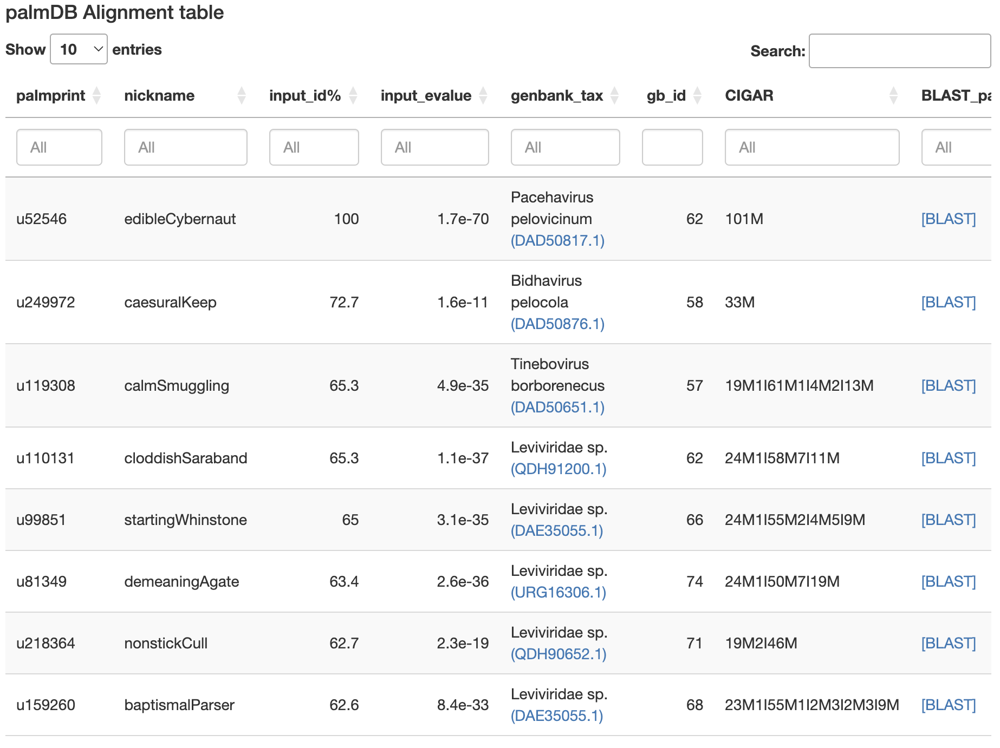
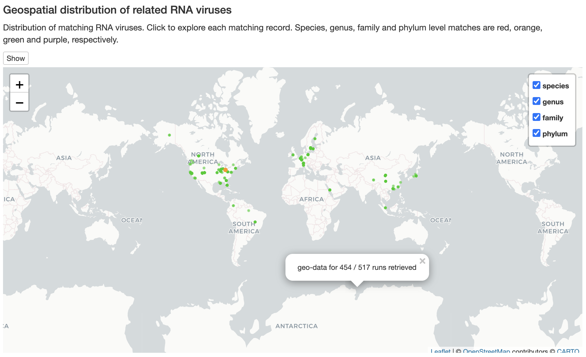
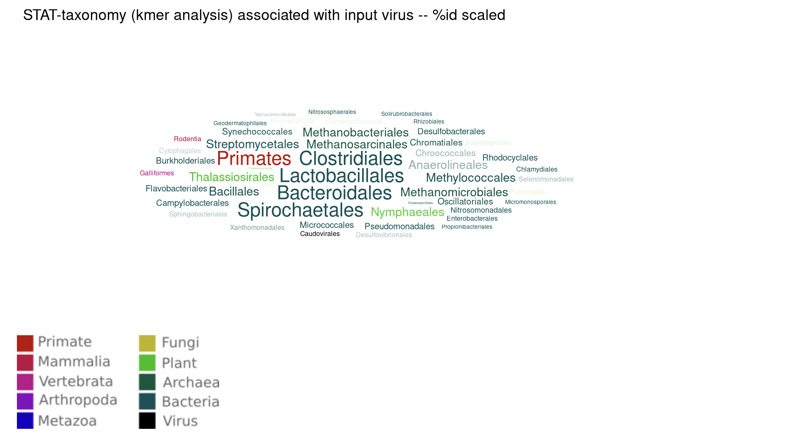

# Serratus.io palmID
written by: [Janette Lau](https://github.com/janettelau)

[15 minutes] `Serratus` is a RNA virus discovery platform which re-analyzed the Sequence Read Archive for the viral RdRP hallmark gene. The `Serratus.io palmID` is a web tool which does a viral-RdRP analysis based on the palmprint RNA virus barcodes that are cross-referenced to palmprints in palmDB.

**Tutorial Objective**: We will use `Serratus.io palmID` to classify and analyze the novel RNA virus, finding relatedness and classifying at different levels by cross-referencing to palmDB.

## Input / Prerequisites
- Access to [serratus.io palmID](https://serratus.io/palmid)
- Web browser
- An RdRP sequence with the A, B and C motifs in amino acid format
- Here is the example data used for demonstration:
```
>SRR6425410_NODE_1981_length_4360_cov_2140.009743_g1473_i0_frame=+1 A:151:ATIDLSSASDSV B:205:MGSAVCFPVETLIF C:244:VYGDDIVI
DDDLINEMVEIVDEWMEGFSYEDTFVPRHGPGSVAGMIGQPPVFAKYQLMRSDALLEYFSKDIGPINEWTPWCIPRGETR
CSEIVCVPKSPISNRTISREPAALQYFQQGIRRSLCKHFDESPLISPHIDLRHQEKSADLARIGSIVGEFATIDLSSASD
SVSLELVKRLCRHQIKLLRGLICTRSKETKLPSGRIIRLKKFAPMGSAVCFPVETLIFATACECACRRTAPHRRSQGFAH
DYRVYGDDIVIRERYVEQLVTVLRSLHFKVNEEKSFSGSRVSLNFREACGGEYFDGYEVTPFRFPRFFKGIDKITDQSAD
HVSSYVSFANKAYERGYLMVRRAILEDLKQAYPDYSKIHRCTDGLTGIQTDDVYCTNFDVKSRYAYYPKLKGRD
```

## Output
The identification of viruses from `palmDB` closely related to your input, with plots and tables showing classifications and analysis of a RdRP input sequence using the palmprint barcode. The expected output generated should be a RNA Virus RdRP Report with multiple tabs and panels.

### 1. Navigate to [Serratus.io - palmID](https://serratus.io/palmid)

### 2. Input an Amino Acid Sequence
Input the amino acid sequence with a header line containing the accession number, node, length, coverage, identifier, and the A, B and C motifs. Click `Analyze Sequence`.



### 3. "Overview"
Gives a big picture of the palmprint detection, `palmDB` search, and SRA search. The `.csv files` are also available for download in this tab.



### 4. "Input RdRP palmprint QC"
The palmscan motif analysis gives us an idea of how confident we are that the input sequence is a RdRP palmprint. In this example, it has a score of 59.7, which indicates "High Confidence".


The QC report displays the RdRP score, palmprint length, V1 and V2 regions relative to the `palmDB`. With an RdRP score above 50, we have high confidence that the input sequence contains a viral RdRP. 



### 5. "MSA & Local Tree"
The Multiple Sequence Alignment shows the 10 closest palmprint sequences in `palmDB` to your input sequence. The higher the percent identity (aa%), the better the match.



Followed below is a UPGMA tree that shows the evolutionary relatedness of your input palmprint with the other matches in palmDB.


### 6. "Input Palmnprint VS PalmDB Analysis"
Here, we have a plot of matches to GenBank against `palmDB` identity. A “species” is found in `palmDB` if the point is right of the red vertical line. A “species” is in GenBank when point is above the gray horizontal dotted line. In this example, the red dot is our input sequence, therefore we can tell that it is novel, not found in GenBank, but found in `palmDB`. 



The Species-, Genus- and Phylum- level taxonomy graph shows what the most number of hits at each level belongs to. In this example, most hits relate to Leviviridae sp..


The `palmDB` Alignment table at the bottom of the page gives you an idea of how similar your input sequence is to the viruses. Pacehavirus pelovicinum is the most related virus identified in GenBank.



### 7. "SRA Meta-data Analysis"
The geospatial distribution of matching RNA viruses is shown on a map here. It gives a visual representation of where you might most likely find the related viruses around the world.



Virus-Organism Associations shows a figure that plots annotation against input identity (aa%) and a Wordcloud. In this example, from the Wordcloud that shows a STAT-taxonomy analysis of the reads contained within the library, it is likely that the virus is infecting a Bacteria.



As for the "Input Alignment to SRA-RdRp Table", it provides important information about how confident the input virus sequence is found in the sequencing libraries. Usually, an E-value below e^-05 indicates it is a significant match. Therefore, in this example, with an E-value of 1.7e-70, we can infer from the table that this palmprint virus is likely found in Macaca mulatta.


### Conclusion

That's it! You've used the `Serratus.io palmID` platform to uncover a novel virus.

Here we have provided an overview on how to apply the serratus.io web interface to novel virus discovery. This is an easy way to map your palmprint input with the large `palmDB` to identify relevance at the specie, genus, family and phylum levels. We can use this tool to classify and analyze the novel virus RdRP input sequence according to its match with `palmDB`.

### See Also:

- [Ribovirus classification by a polymerase barcode sequence](https://peerj.com/articles/14055/)
- [Additional Introduction to palmID](https://github.com/ababaian/palmid#readme)
